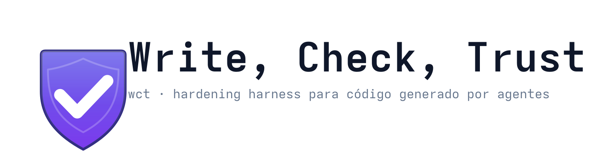
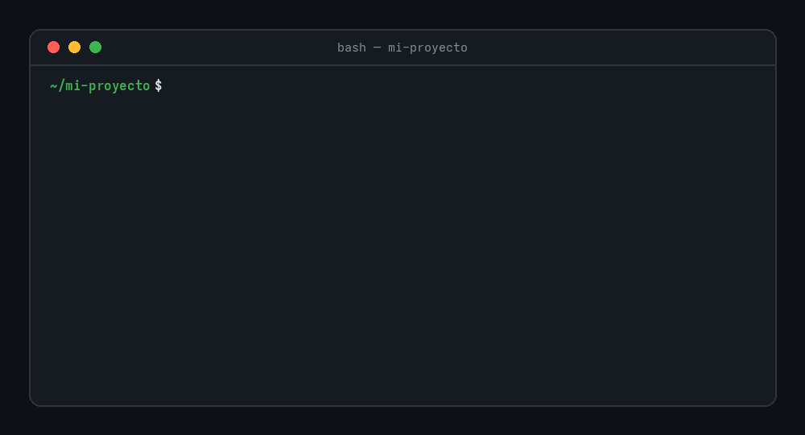
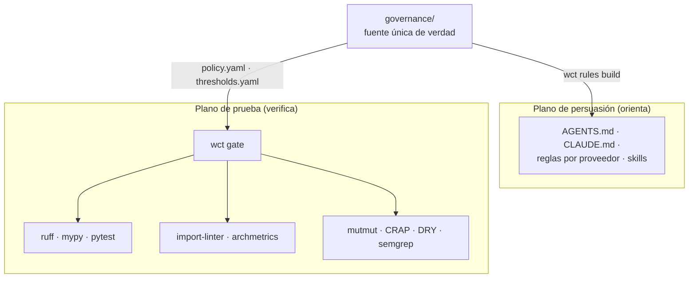

<p align="center">
  <picture>
    <source media="(prefers-color-scheme: dark)" srcset="docs/assets/wct-banner-dark.svg">
    
  </picture>
</p>

<p align="center">
  <a href="https://github.com/Yosoyepa/write-check-trust/releases"></a>
  <a href="https://github.com/Yosoyepa/write-check-trust/actions/workflows/quality.yml"></a>
  <a href="https://github.com/Yosoyepa/write-check-trust/actions/workflows/full-hardening.yml"></a>
  <a href="LICENSE"></a>
  
</p>

<p align="center">
  
  <a href="https://docs.astral.sh/ruff"></a>
  
  
</p>

Base de hardening agnóstica al proveedor para código generado por agentes.
Combina instrucciones de desarrollo con verificadores ejecutables, hooks
fail-closed, ratchets, tests adversariales y separación entre autor y
verificador. Pensada para modelos de alto volumen y bajo costo por token: hace
que entregar código malo sea caro y detectable, sin depender de inferencia
cara para revisarlo.

No promete demostrar que un programa es correcto. Sí hace difícil entregar
código sin formato, sin tests útiles, con dependencias ilegales, arquitectura
erosionada, secretos, supresiones gratuitas o controles manipulados.

<p align="center">
  
</p>

<p align="center"><em>Salida real del harness: la segunda corrida falla porque el changeset contiene un import sin uso y formato roto.</em></p>

## Modelo de confianza

El template separa dos planos: **persuasión** (orienta al agente, no prueba
nada) y **prueba** (códigos de salida autoritativos). `governance/` es la
única fuente de verdad; las reglas por proveedor se generan y `wct rules
check` rechaza el drift manual.



Detalles completos en [docs/architecture.md](docs/architecture.md).

## Inicio rápido

Requiere Python 3.11–3.14, `uv` y Git.

```bash
make bootstrap
uv run wct doctor
uv run wct gate --tier commit
```

`make bootstrap` instala grupos dev/quality, genera reglas, crea el lock de
integridad e instala pre-commit. Tras editar archivos protegidos con
aprobación humana (ver [runbook](docs/runbook.md)), en UNA sola línea:

```bash
uv run wct integrity bless --approved-by "nombre" --reason "aprobado en PR #N: explicación concreta"
```

> [!IMPORTANT]
> El `--reason` debe citar evidencia de aprobación (URL o `#N`); una frase en
> prosa no prueba nada y el comando la rechaza. `bless` (y `ratchet record`, y
> `mutate update-manifest --approved-by`) es exclusivamente humano: el hook
> PreToolUse bloquea al agente que lo intente, incluida su forma
> `python -m tools.wct ...`.

## Tiers y gates

| Tier | Uso | Presupuesto | Gates |
|---|---|---:|---:|
| `fast` | feedback durante edición y PostToolUse | 10 s | 7 |
| `commit` | pre-commit, Stop y handoff | 120 s | 19 |
| `pr` | espejo local de la CI de PR, antes de pushear | 10 min | 25 |
| `full` | release, hardener y CI programada | 30 min | 30 |

```bash
uv run wct gate --tier fast
uv run wct gate --tier commit
uv run wct gate --tier pr    # o make pr
uv run wct gate --tier full
```

El catálogo completo —qué exige cada gate y con qué herramienta se verifica—
está en [docs/gates.md](docs/gates.md). El tier `pr` existe para que la
verificación local sea fiel a CI: todo lo que `quality.yml` exige de una PR,
en un solo comando (nació de una entrega del piloto que pasó 17/17 local y
falló en CI por diff-coverage que ningún tier local exponía).

> [!CAUTION]
> Un gate que crashea retorna exit 2 y **bloquea** (fail-closed): nunca se
> interpreta como permiso.

## Comandos propios

```bash
uv run wct rules build|check
uv run wct doctor
uv run wct report
uv run wct ratchet check
uv run wct archmetrics --json
uv run wct dry --json
uv run wct introvert --json
uv run wct mutate scan|run|update-manifest
uv run wct accept parse|ir-dry|generate|run|mutate [feature]
uv run wct selftest redteam
uv run wct adopt [ruta]
uv run wct adopt lock --source <path-clon> [--paths tools/wct] [--force]
uv run wct adopt check --source <path-clon> [--ref HEAD] [--json]
uv run wct adopt sync --source <path-clon> --ref <ref> [--out patch] [--json]
uv run wct fmt [--staged]
uv run wct split-plan <archivo> [--json]
uv run wct hotspots [--days 90] [--top 10] [--json]
```

### Ciclo de vida del arnés vendido (`wct adopt lock/check/sync`)

Mecaniza la actualización de vendoring (ej. repositorios que embeben `tools/wct/`)
siguiendo el patrón cruft/copier: **acoplamiento por hash de commit exacto**.

- **`wct adopt lock --source <path>`**: genera `.wct-upstream.json` acoplando los paths al HEAD SHA y URL de origen del clon upstream.
- **`wct adopt check --source <path> [--ref <ref>]`**: reporta en tres secciones:
  1. *Drift*: clasificación de archivos locales vs upstream en el commit bloqueado (`identical`, `diverged`, `solo-local`, `solo-upstream`).
  2. *Behind*: cambios en upstream entre el commit bloqueado y `--ref`.
  3. *Conflict candidates*: archivos con divergencia local y cambios en upstream (`diverged ∩ changed`).
- **`wct adopt sync --source <path> --ref <ref>`**: genera el unified diff patch (`build/tmp/wct-sync.patch`) y destaca candidatos a conflicto para revisión manual. **Propone, nunca ejecuta**: ningún archivo del proyecto se modifica automáticamente.

### Hotspots: dónde refactorizar primero

`wct hotspots` cruza el churn de `git log --numstat` con la complejidad
cognitiva por archivo (Tornhill): el mejor predictor empírico de defectos
publicado. Es asesor — exit 0 siempre — porque un umbral de churn castigaría
a los módulos simplemente activos.

### Formateo acotado al changeset

`wct fmt` formatea SOLO el changeset (diff contra main/master más el árbol de
trabajo); `wct fmt --staged` se limita a lo staged.

> [!TIP]
> En proyectos con G-FMT desactivado para adopción gradual, `wct fmt` es el
> único formateo permitido para agentes: un `ruff format` global re-formatea
> archivos legacy intactos y detona G-MUT-SITES en archivos ajenos a la tarea.

### Manifiesto de mutación y bless atómico

`wct mutate update-manifest` regenera el manifiesto diferencial: las funciones
se identifican por fingerprint semántico `archivo::qualname`, no por línea
(insertar un import ya no invalida medio archivo). Con aprobación humana
explícita regenera también el lock en el mismo paso, así G-META-1 nunca
observa un manifiesto fresco con un lock desfasado.

### Split preventivo propuesto

`wct split-plan <archivo>` propone (nunca ejecuta) la partición fachada de
TEST-007 para un archivo sobre el presupuesto de sitios de mutación: partes
con sus funciones y sitios, imports de re-exportación para la fachada, y
rechazo explícito cuando una función sola excede el límite (entonces toca
partir la función, no el archivo).

### Webhooks

`wct webhook` emite un envelope JSON v1 firmado con HMAC-SHA256; URL y secreto
solo del entorno, HTTP rechazado salvo localhost. El contrato está en
`governance/adapters/webhook.schema.json` y el uso, en el
[runbook](docs/runbook.md#webhooks).

## Arquitectura de ejemplo

```text
entrypoints → adapters → application → domain
```

`domain` no conoce IO ni frameworks. `application` define los puertos que usa;
los adaptadores los implementan. `.importlinter` hace cumplir la dirección y
`wct archmetrics` calcula fan-in, fan-out, `I`, `A`, `D` y ciclos. Los imports
bajo `if TYPE_CHECKING:` no cuentan como dependencia; la dinámica que oculte
módulos del proyecto se reporta como evasión. Las excepciones documentadas de
wiring diferido viven en `governance/thresholds.yaml` →
`architecture.cycle_allowlist`.

## Skills y agentes

Las 14 skills canónicas viven en `skills/`; `.claude/skills/` contiene la
copia para Claude y `plugins/write-check-trust/skills/` la distribución Codex.
Los roles de `.claude/agents/` son `specifier`, `coder`, `cleaner`,
`architect`, `hardener` y `verifier`. El verificador carece de Edit/Write:
quien produjo el cambio no modifica la evidencia de aprobación.

## Adopción en un repositorio existente

Primero un inventario read-only: `uv run wct adopt ../mi-proyecto`. Después
configura capas y rutas, mide baselines reales y conserva dos reglas:

- código cambiado usa el perfil estricto;
- deuda legacy solo puede mejorar mediante ratchets.

> [!WARNING]
> No copies los baselines verdes de este ejemplo a un sistema legacy: medir
> una ficción equivale a desactivar los gates.

## CI y bypasses

- `.pre-commit-config.yaml` ejecuta fast tier y valida Conventional Commits.
- `.github/workflows/quality.yml` corre `wct integrity check` tras el
  `uv sync --frozen` — una PR que toque rutas protegidas sin bless falla en
  CI, no solo en local — y añade commit tier, aceptación mutada y red-team.
- `full-hardening.yml` ejecuta el tier completo semanalmente y bajo demanda.
- Claude Code aplica hooks PreToolUse, PostToolUse, PostToolBatch, Stop,
  SubagentStart/Stop, ConfigChange y PostCompact.
- `git commit --no-verify`, ediciones directas de archivos protegidos y
  comandos indirectos contra el plano de control se bloquean.
- El Stop hook tiene dos válvulas anti-deadlock: con `WCT_HOOK_ROLE=observer`
  los roles de solo lectura (verificador, resumidor) advierten en vez de
  bloquear; y la tercera bloqueada consecutiva pasa con advertencia
  `DEADLOCK GUARD` y la obligación de declarar el árbol rojo en el handoff.
  Pasar por una válvula no verdea el árbol: la CI de PR sigue siendo la
  frontera dura.

El runbook del mantenedor (bless con baseline, Dependabot en bloque, ratchets,
flaky tests) está en [docs/runbook.md](docs/runbook.md).

## Verificación del harness

```bash
uv run pytest -q
uv run wct selftest redteam   # 30 adversarios, F1–F15
uv run wct gate --tier full
```

## Documentación

| Documento | Contenido |
|---|---|
| [docs/STATUS.md](docs/STATUS.md) | Estado real del proyecto, verificable por comando — léelo primero: distingue implementado de pendiente. |
| [docs/gates.md](docs/gates.md) | Catálogo completo: 34 gates en 4 tiers con verificador y comando. |
| [docs/architecture.md](docs/architecture.md) | Persuasión vs prueba, capas, métricas A/I/D, lock de integridad. |
| [docs/runbook.md](docs/runbook.md) | Bless, manifiesto de mutación, Dependabot, ratchets, webhooks, CI. |
| [docs/README.md](docs/README.md) | Índice: assets, ADRs y documentación de proyecto. |
| [PLAN.md](PLAN.md) | Decisiones, fases, límites y evolución del harness. |
| [RESEARCH.md](RESEARCH.md) | Investigación fuente detrás de cada decisión. |

Para contribuir: [CONTRIBUTING.md](CONTRIBUTING.md). Vulnerabilidades:
[SECURITY.md](SECURITY.md) (reporte privado). Comunidad:
[código de conducta](CODE_OF_CONDUCT.md). Avisos de terceros:
[THIRD_PARTY_NOTICES.md](THIRD_PARTY_NOTICES.md).

## Límites honestos

Ningún linter prueba requisitos omitidos, decisiones de producto, usabilidad,
ética, rendimiento real, calibración de hardware o seguridad completa. Los
análisis DRY, A/I/D e introvert son heurísticos; por eso combinan evidencia
automática, ratchets y revisión independiente. Los gates reducen el riesgo y
la superficie de autoengaño, no sustituyen la responsabilidad humana.

## Licencia

[MIT](LICENSE) © 2026 Write, Check, Trust contributors.
