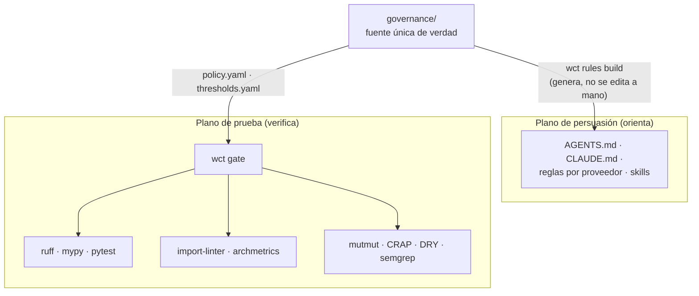

# Arquitectura

## Modelo de confianza: persuasión vs prueba

El template separa dos planos con papeles distintos:

- **Persuasión** — orienta al agente, no prueba nada: `CLAUDE.md`, `AGENTS.md`,
  reglas de Cursor/Copilot/Gemini/Windsurf, skills y subagentes.
- **Prueba** — códigos de salida autoritativos: `wct`, Ruff, mypy, pytest,
  import-linter, mutmut, Semgrep, Bandit, deptry, pre-commit y CI.



`governance/rules/*.yaml` es la fuente; las copias por proveedor se generan con
`wct rules build` y `G-RULES-DRIFT` rechaza el drift manual. Un agente puede
editar persuasión solo a través de la fuente, nunca del artefacto generado.

## Capas de la aplicación

```text
entrypoints → adapters → application → domain
```

- `domain/` — puro, sin IO ni frameworks. No importa ninguna otra capa.
- `application/` — casos de uso; define los puertos que USA (Protocol).
- `adapters/` — implementa puertos, envuelve frameworks y clientes.
- `entrypoints/` — CLI/API; valida y normaliza entrada en la frontera.

`.importlinter` hace cumplir la dirección (`G-ARCH`). `wct archmetrics`
construye el grafo de imports en runtime y calcula fan-in, fan-out,
inestabilidad `I`, abstracción `A` y distancia `D = |A + I - 1|` (`G-ARCHMETRICS`):

- `I` = fan-out / (fan-in + fan-out) — qué tan estable es el paquete.
- `A` = abstracciones reales (Protocol, ABC con `@abstractmethod`, TypeVar
  con bound, singledispatch) / total de símbolos.
- La **Zona de Dolor** (concreto + estable) y la **Zona de Inutilidad**
  (abstracto + inestable) están vetadas.

Matices del grafo:

- Los imports bajo `if TYPE_CHECKING:` no cuentan (desaparecen en runtime).
- `importlib.import_module`/`__import__` que oculten módulos del proyecto se
  reportan como evasión.
- Las excepciones documentadas de wiring diferido viven en
  `governance/thresholds.yaml` → `architecture.cycle_allowlist`.

## Plano de control e integridad

`governance/` es la única fuente de verdad de reglas, umbrales, baselines y
lock. Las rutas del plano de control (`governance/**`, `pyproject.toml`,
`.pre-commit-config.yaml`, `.importlinter`, `.github/workflows/**`,
`.claude/settings.json`) están protegidas por el **lock de integridad**:

1. `wct integrity check` (G-META-1) compara el hash EOL-normalizado de cada
   ruta contra `governance/integrity.lock`.
2. Un cambio no bendecido deja el gate en rojo — local, en pre-commit y en CI.
3. La única vía de aprobación es humana:

   ```bash
   uv run wct integrity bless --approved-by "nombre" --reason "aprobado en PR #N: explicación"
   ```

   El `--reason` debe citar evidencia (URL de PR/comentario o `#N`). El hook
   PreToolUse bloquea al agente que intente `bless`, `ratchet record` o
   `mutate update-manifest --approved-by`, incluida la forma
   `python -m tools.wct ...`.

Los ratchets siguen la misma lógica monótona: una métrica puede mejorar,
nunca retroceder. Subir un umbral requiere
`wct ratchet raise --reason ... --approved-by <humano>` y queda registrado en
`governance/ratchet-log.md`.

## Versiones

La versión vive SOLO en `pyproject.toml`. `__version__` (de `example` y de
`tools.wct`) se deriva de `importlib.metadata` con fallback `0.0.0+local`.
Un bump de release no se sincroniza a mano en dos sitios.

## Minimalismo vendorizado (Ponytail)

La escalera minimalista se vendó como capa de sesgo con cuatro overrides
obligatorios (dependency rule sobre peldaño 5, anulación del self-check sin
frameworks, marcadores con owner e issue, modo `ultra` prohibido). La decisión
completa está en [`governance/decisions/ADR-001-ponytail.md`](../governance/decisions/ADR-001-ponytail.md);
el razonamiento fuente, en [`RESEARCH.md`](../RESEARCH.md).
